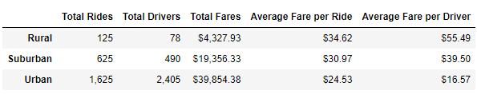
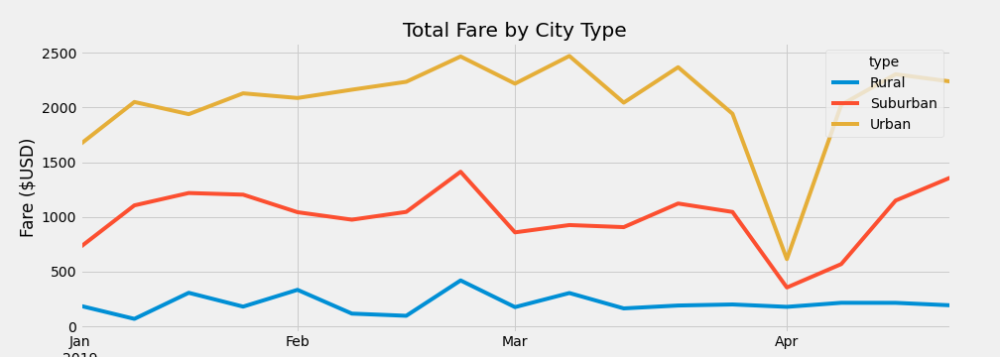

# PyBer_Analysis

## Overview of the Analysis
The purpose of this analysis is to compare ride share data for the company PyBer based on the location of the ride: urban, suburban, and rural cities. This analysis will allow PyBer to think geographically about their market and plan to improve performance and profits based on area. 

## Results
Upon comparing ride-sharing data based on geographical area (urban, suburban, and rural cities), the following information was found: 

From this image, it is aparent that urban areas lead the subcategories with the highest total rides, total drivers, and total fares (followed by suburban and rural areas, respectively). However, the inverse is true for average fare per ride and average fare per driver. In these categories, urban areas have the lowest values followed by suburban and rural areas. 

To further investigate and establish whether urban areas lead other subcategories in total fares, timeframe was investigated. A line graph of total fares by city type with the x-axis being time was created. When looking at the figure below, it can observed that urban areas top total fare regardless of the timeframe from January through April, with suburban and rural areas falling below. 

## Summary
Due to population density, it is to be expected that it may be more difficult to increase total rides, drivers, and fares. However, based on this data, there is room for improvement that may close some of the gaps between city type. The following are suggestions in order to address the disparities among city types and improve total rides, total drivers, and total fares in suburban and rural areas:
- In order to attract more riders to the rideshare service in suburban and rural areas, it may be helpful to offer a geographical promotion, either to increase the number of rides that current riders are taking or attract new riders to the service.
- Because there are less drivers in rural areas, it is possible that it is challenging for a rider to get a ride. Incentivizing the current drivers that are available to give more rides in a set time period or incentivizing new drivers to begin giving rides could support. 
- The average fare per ride is considerably higher in rural areas, presumably due to fares being charged by distance/time and locations being further apart in rural areas. It may be helpful to consider having a different or scewed calculation for fares in rural areas to ensure they are not cost prohibitive. 

More investigation is necessary to determine whether the suggestions above actually address the root cause of the above issues. For example, in order for the first bullet point to be a viable solution, it may be helpful to collect data on whether riders are actually struggling to get a ride in rural areas. This could be done through a quick 1-2 question survey after a ride. 
